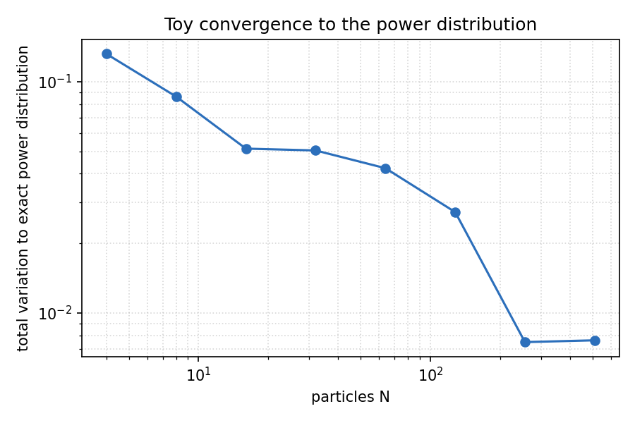
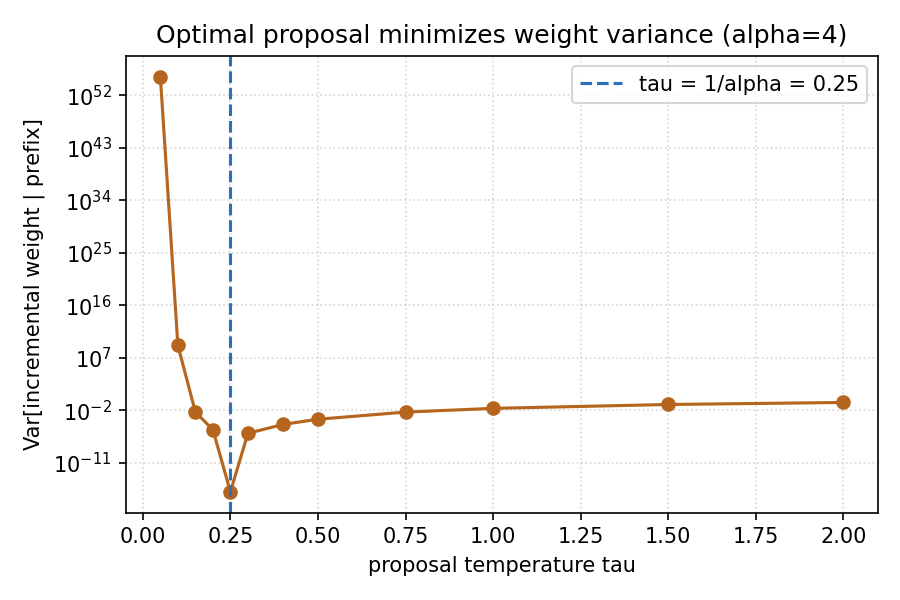

# power-smc

Fast, training-free sequence-level power sampling for LLM reasoning. This is an open
reproduction of *Power-SMC: Low-Latency Sequence-Level Power Sampling for Training-Free
LLM Reasoning* (Azizi, Baghaei Potraghloo, Ahmadi, Kundu, Pedram; arXiv:2602.10273),
which had no public implementation when I started this.

A base model's reasoning can be unlocked by sampling its high-likelihood sequences, but
the principled way to do that is 16 to 28 times slower than normal decoding. Power-SMC
targets the same distribution with a batch-parallel particle method and gets the overhead
down to roughly 1.4 to 3.3 times, which makes it nearly as fast as ordinary decoding.

## Why this is interesting

There is a live argument in the field that a lot of the reasoning gains usually credited
to RL post-training can instead be understood as distribution sharpening: biasing
generation toward the high-likelihood trajectories the base model already supports,
without touching its weights. Karan and Du showed you can do exactly this by sampling
from the sequence-level power distribution with Metropolis-Hastings, and match RL-level
reasoning. The catch is that MH is inherently serial. Each move regenerates a long suffix
and the accept/reject loop cannot be parallelized, so it is very slow.

Power-SMC keeps the same target distribution but replaces the serial chain with N
particles that move forward together in a single batched decode. That is the whole point:
same distribution, a fraction of the latency.

## The target and the method

The sequence-level power distribution raises the whole-sequence probability to a power
`alpha >= 1`:

```
pi_alpha(y | x) = p_theta(y | x)^alpha / Z_alpha(x)
```

This is not the same as lowering the temperature per token. Exponentiating each token's
conditional independently does not exponentiate the joint, so naive low-temperature
sampling does not target this distribution. That distinction is what makes a real sampler
necessary, and it is checked directly in the toy model here.

Power-SMC (Algorithm 1 in the paper) runs N particles in parallel:

1. Every particle proposes its next token from a cheap prefix-only proposal.
2. Each particle's weight is multiplied by the incremental correction
   `p_theta(y_t)^alpha / q(y_t)` that makes the particle set target `pi_alpha` exactly.
3. When the effective sample size drops below `kappa * N`, the particles are resampled
   (systematic resampling), the KV cache is reindexed by ancestor, and weights reset.
4. EOS is an absorbing state: once a particle emits it, the particle stops advancing.
5. At the end, the output is drawn from the final weighted particle set.

The default proposal is temperature `1/alpha`, that is, the model distribution raised to
`alpha` and renormalized. The paper proves this is the unique prefix-only proposal that
minimizes the variance of the incremental weights, and this repo confirms it.

## What is verified here

Correctness comes first, and it runs on a CPU in a few seconds with no model download:

```bash
pip install -r requirements.txt
python validate.py
```

**Convergence to the exact power distribution.** On a tiny model whose power distribution
can be computed by brute force, the SMC particle set converges to it as the number of
particles grows.

| particles N | total variation to exact power distribution |
|-------------|---------------------------------------------|
| 4           | 0.132                                       |
| 16          | 0.051                                       |
| 64          | 0.042                                       |
| 256         | 0.007                                       |
| 512         | 0.008                                       |



**The variance claim.** The incremental-weight variance is minimized at `tau = 1/alpha`,
where it is exactly zero, and grows away from it in both directions.



Both checks are also encoded as tests (`pytest`), along with tests for systematic
resampling, EOS absorption, seed reproducibility, and the KV-cache reindexing across
several transformers cache formats.

## Reproducing the MATH500 tradeoff

The headline artifact is an accuracy-vs-latency plot with three points: baseline
decoding, MH power sampling, and Power-SMC. This part needs a GPU. It fits on a free
Colab or Kaggle T4 with a small reasoning model in 4-bit and a modest particle count.

```bash
# baseline decoding
python experiments.py run --method baseline \
    --model Qwen/Qwen2.5-1.5B-Instruct --subset 100 \
    --out results/math500_baseline.csv

# Power-SMC
python experiments.py run --method power-smc \
    --model Qwen/Qwen2.5-1.5B-Instruct --subset 100 \
    --particles 16 --alpha 4 --out results/math500_power_smc.csv

# build the plot
python experiments.py plot \
    --inputs results/math500_baseline.csv results/math500_power_smc.csv \
    --out results/plots/accuracy_latency.png
```

`notebook.ipynb` runs the whole thing top to bottom and is the easiest way to try it.

### The MH baseline

I do not reimplement Metropolis-Hastings. The reference is Karan and Du's public repo,
[reasoning-with-sampling](https://github.com/aakaran/reasoning-with-sampling), which has
MATH500 power-sampling scripts. `power_smc/baselines.py` has a thin wrapper
(`MHReference`) that clones it, runs its MATH500 script, and parses the output CSVs so
you can drop an MH point onto the same plot. Validating Power-SMC against a real MH
implementation, rather than one I wrote myself, is the main reason to trust the
comparison.

## Repository layout

```
power_smc/
  power_target.py   power distribution + a toy model with exact enumeration
  proposal.py       prefix-only proposals, temperature 1/alpha, incremental weights
  smc.py            Algorithm 1: particles, ESS, systematic resampling
  kv_cache.py       cache-safe resampling (KV reindexing by ancestor)
  ramping.py        alpha-ramping (exponent bridging) schedule
  hf_model.py       Hugging Face model wrapped as the SMC model interface
  baselines.py      baseline decoding + wrapper around Karan and Du's MH code
  plotting.py       validation and accuracy-vs-latency plots
validate.py         CPU correctness checks (convergence + variance)
experiments.py      MATH500 driver, grading, and latency measurement
notebook.ipynb      one-click Colab / Kaggle demo
tests/              pytest suite
results/            committed CSVs and plots
```

The SMC loop in `smc.py` is model-agnostic. It talks to a small three-method interface
(`prefill`, `decode`, `reorder`), and both the toy model and the real Transformer
implement it, so the exact same Algorithm 1 code path validates on the toy and runs on a
real model.

## Matches, divergences, and limitations

- **Matches.** The power target (Eq. 1), the incremental weight (Eq. 8), the ESS
  definition and `kappa * N` threshold, systematic resampling, EOS as an absorbing state,
  the temperature-`1/alpha` proposal, and alpha-ramping via exact exponent bridging all
  follow the paper. Ramping is off by default and, when on, converges to the same target
  in the toy check.
- **Divergences.** Next-token log-probs cross from the GPU to numpy inside the loop for a
  clean, framework-independent sampler. For small particle counts this is cheap next to
  the forward pass, but it is not the last word in throughput, and the paper's absolute
  latency numbers depend on model, hardware, and kernels. I reproduce the direction and
  rough magnitude of the tradeoff, not exact wall-clock figures.
- **Limitations.** The scored model has to be open-weight, since power sampling needs
  per-token probabilities and control over the KV cache, which closed APIs do not expose.
  Memory scales with particle count times model size, so on a T4 keep the model small
  (1.5B to 4B in 4-bit) and the particle count modest. Finished particles keep being fed
  EOS, which wastes a little compute; this is noted in the code and left simple on
  purpose.

## Citation

If this is useful, please cite the original paper and, optionally, this reproduction
(see `CITATION.cff`).

- Azizi, Baghaei Potraghloo, Ahmadi, Kundu, Pedram. *Power-SMC: Low-Latency
  Sequence-Level Power Sampling for Training-Free LLM Reasoning.* arXiv:2602.10273.
- Karan, Du. *Reasoning with Sampling: Your Base Model is Smarter Than You Think.*
  https://github.com/aakaran/reasoning-with-sampling

## License

MIT. See `LICENSE`.
